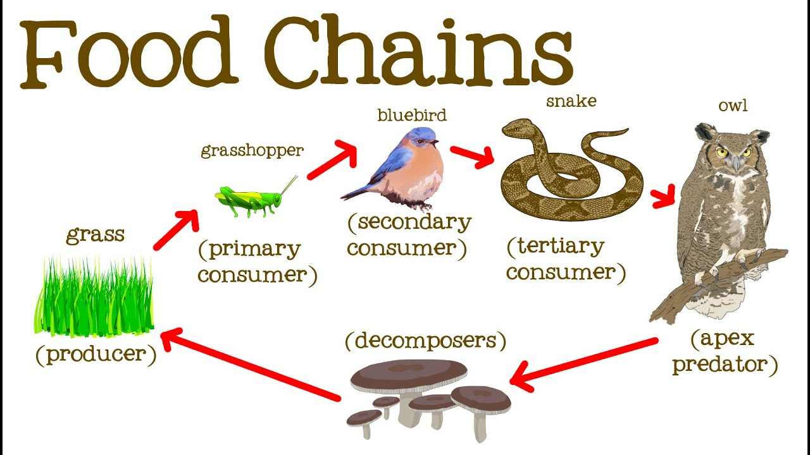

# Food Chains Simulation
Food Chains Simulation Utilizing Polymorphism in C++

## Setup
In a 10 x 10 grid:
- only one species may occupy a cell at a time. 
- The grid is enclosed
- Time is simulated in time steps.
- Each species performs some action every time step
- For the sake of simplicity, each species breed asexually.
- Once an animal produced an offspring, the animal cannot produce an offspring until three more time steps have elapsed.

### Grass
- Move: Grass cannot move.
- Breed: Grass cannot breed.

## Grasshopper
- Predator: Bluebird
- Move: Every time step, randomly to move up and, down, left or right. If the cell in the select direction is oocupied by other species other than grass or would move the grasshopper off the drid, then the ant stays in the current cell.
- Breed: If a grasshopper survies for 3 time step, then at the end of the third time step (i.e. after moving) the grasshopper will breed. This is simulated by creating a new grasshopper in an adjancent cell that is either empty or occupied by grass. If there is no empty cells, no breeding occurs.
- Starve: If a grasshopper has not eaten grass with in the last 2 time steps, the grasshopper will strave and die at the end of the second time step. 

### Bluebird
- Predator: Snake
- Move: Every time step, randomly to move up and, down, left or right. If the cell in the select direction is not either empty or occupied by grasshopper or would move the bluebird off the grid, then the bluebird stays in the current cell.
- Breed: If a bluebird survies for 5 time steps, then at the end of the fifth time step (i.e. after moving) the bluebird will breed. This is simulated by creating a new bluebird in an adjancent cell that is empty. If there is no empty cells, no breeding occurs.
- Starve: If a bluebrird has not eaten grasshopper with in the last 3 time steps, the bluebird will starve and die at the end of the third time step.

### Snake
- Predator: Owl
- Move: Every time step, randomly to move up and, down, left or right. If the cell in the select direction is not either oocupied by a bluebird or empty, or would move the snake off the grid, then the snake stays in the current cell.
- Breed: If a snake survies for 8 time steps, then at the end of the eighth time step (i.e. after moving) the snake will breed. This is simulated by creating a new snake in an adjancent cell that is empty. If there is no empty cells, no breeding occurs.
- Starve: If a snake has not eaten bluebird with in the last 5 time steps, the snake will starve and die at the end of the fifth time step.

### Owl
- Move: Every time step, randomly to move up and, down, left or right. If the cell in the select direction is not either oocupied by a snake or empty, or would move the owl off the grid, then the owl stays in the current cell.
- Breed: If an owl survies for 13 time steps, then at the end of the thirteenth time step (i.e. after moving) the owl will breed. This is simulated by creating a new owl in an adjancent cell that is empty. If there is no empty cells, no breeding occurs.
- Starve: If an owl has not eaten snake with in the last 8 time steps, the owl will starve and die at the end of the eighth time step.

### Decomposer
- Dead animal will become decomposer after 1 time step.
- Decomposer become grass after 3 time steps. 
- Move: Decomposer cannot move
- Breed: Decomposer cannot breed.
